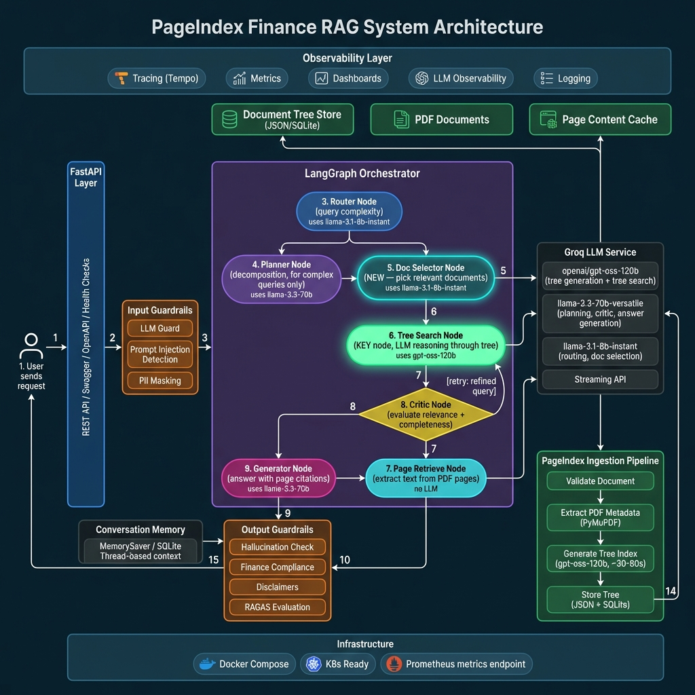

# FinSight — Agentic Finance Document RAG

> **An enterprise-grade platform for deep financial document analysis, powered by PageIndex + LangGraph.**

Upload lengthy financial PDFs, interim reports, and annual reviews — FinSight builds a hierarchical semantic tree of every document and uses multi-agent LLM reasoning to extract, synthesize, and compare complex financial data with full source citations.

---

## 📊 Architecture



The system replaces traditional vector-based RAG with **PageIndex** — a tree-structured index navigated by LLM reasoning agents orchestrated through **LangGraph**.

### Agentic Query Pipeline

```
User Question
    │
    ▼
┌─────────────┐    ┌──────────────┐    ┌──────────────────┐
│  Guardrails │───▶│    Router     │───▶│   Doc Selector   │
│ (input val) │    │ (complexity)  │    │ (which PDFs?)    │
└─────────────┘    └──────────────┘    └──────────────────┘
                                              │
                         ┌────────────────────┤
                         ▼                    ▼
                  ┌─────────────┐    ┌──────────────────┐
                  │   Planner   │    │  Tree Searcher   │
                  │ (multi-hop) │───▶│ (LLM tree walk)  │
                  └─────────────┘    └──────────────────┘
                                              │
                                              ▼
                                     ┌──────────────────┐
                                     │ Page Extractor   │
                                     │ (PyMuPDF pages)  │
                                     └──────────────────┘
                                              │
                         ┌────────────────────┤
                         ▼                    ▼
                  ┌─────────────┐    ┌──────────────────┐
                  │   Critic    │    │    Generator     │
                  │ (evaluate)  │───▶│ (final answer)   │
                  └─────────────┘    └──────────────────┘
                                              │
                                              ▼
                                     ┌──────────────────┐
                                     │  Guardrails      │
                                     │ (output + discl.) │
                                     └──────────────────┘
```

**Nodes explained:**

| Node | Role |
|------|------|
| **Guardrails** | Validates input (injection detection, PII filtering) and output (financial disclaimers). |
| **Router** | Classifies query complexity: `simple`, `standard`, `complex`, `multi_hop`. |
| **Doc Selector** | Reads tree root summaries to pick which documents are relevant. |
| **Planner** | For complex/multi-hop queries, generates a step-by-step execution plan. |
| **Tree Searcher** | LLM navigates the PageIndex tree top-down, selecting relevant branches at each level. |
| **Page Extractor** | Extracts exact page text from PDFs via PyMuPDF (replaces chunk retrieval). |
| **Critic** | Scores relevance/groundedness of retrieved content; triggers re-search if low. |
| **Generator** | Synthesizes final answer with inline source citations. |

---

## 🧠 PageIndex vs Traditional RAG vs Vector DB

### The Problem with Traditional RAG

Traditional RAG (Retrieval-Augmented Generation) systems chunk documents into fixed-size pieces, embed them into vectors, and retrieve the top-k nearest neighbors. This works for simple lookups but **fails for financial documents** because:

- Fixed-size chunks split tables, footnotes, and multi-page sections mid-sentence.
- Vector similarity misses structural relationships (e.g., "this footnote refers to the balance sheet on page 23").
- No reasoning about *where* to look — just brute-force similarity.

### Comparison Table

| Dimension | Traditional RAG (Vector DB) | PageIndex (This System) |
|---|---|---|
| **Index structure** | Flat list of chunks + embeddings | Hierarchical semantic tree (like a smart TOC) |
| **Retrieval method** | Vector similarity (cosine/dot-product) + optional BM25 + reranker | LLM reasoning: top-down tree traversal |
| **Chunking** | Fixed-size (512–1024 tokens) or recursive text splitting | No chunking — full pages extracted on demand |
| **Cross-page context** | Lost at chunk boundaries | Preserved — tree nodes span page ranges |
| **Tables & structured data** | Often split across chunks | Detected per-page, kept intact as Markdown |
| **Multi-document queries** | Retrieve chunks from all docs, hope reranker sorts them | Doc Selector picks relevant documents first, then searches each tree |
| **Explainability** | "These 5 chunks scored highest" | Full reasoning trace: "I checked Financial Statements → Balance Sheet → found debt figures on pages 23–30" |
| **Infrastructure** | Requires vector DB (Qdrant/Pinecone/Weaviate) + embedding model | JSON files on disk (or Convex), no vector DB needed |
| **Ingestion cost** | Embed every chunk ($$$ for large corpora) | One LLM call per document to build tree |
| **Query cost** | Embedding + ANN search + reranker | 2–4 LLM calls (tree levels) per query |
| **Best for** | Simple fact lookup in homogeneous text | Complex financial analysis, cross-document comparison, regulatory review |

### ✅ Pros of PageIndex

- **No vector database** — simpler infra, no embedding model, no similarity tuning
- **Preserves document structure** — sections, sub-sections, tables, footnotes stay intact
- **Explainable retrieval** — full reasoning trace shows *why* pages were selected
- **Handles long documents** — 500+ page annual reports without quality loss
- **Multi-hop reasoning** — Planner breaks complex queries into steps, each navigating the tree
- **Exact page extraction** — answers cite precise page numbers, not abstract chunk IDs

### ⚠️ Cons of PageIndex

- Higher per-query latency — each tree level requires an LLM call (~2–4 calls per query)
- Depends on LLM quality — tree generation and search quality are only as good as the model
- Ingestion takes longer — building the tree index takes 30–120s per document (vs instant embedding)
- Not suited for keyword search — pure semantic reasoning, no BM25 fallback
- Tree quality varies — documents without clear structure (e.g., scanned images) produce weaker trees

---

## 🚀 Features

- **Premium UI/UX** — Built with Next.js 16, Framer Motion, GSAP, and Tailwind CSS. Dark mode with orbital animations, liquid glass effects, and 3D magnetic hover cards.
- **PageIndex Architecture** — LLM-generated hierarchical tree index replaces vector chunking entirely.
- **Agentic LangGraph Orchestrator** — Router → Doc Selector → Planner → Tree Searcher → Critic → Generator pipeline with conditional edges and retry loops.
- **Output Guardrails** — Input validation (injection detection, PII filtering), output validation (financial disclaimers).
- **Real-time Auth** — Clerk authentication with JWT-protected API endpoints.
- **Convex Data Layer** — Real-time database for conversations, messages, documents, and telemetry.
- **Local Observability** — SQLite databases for telemetry, conversations, and metadata during development.

---

## 🛠️ Tech Stack

| Component | Technology |
|-----------|------------|
| **Frontend** | Next.js 16 (App Router) + React 19 |
| **Frontend Styling** | Tailwind CSS 4 + Framer Motion + GSAP + Three.js |
| **Authentication** | Clerk (`@clerk/nextjs ^6.39`) |
| **Real-time Data** | Convex (`convex ^1.32`) |
| **Backend API** | FastAPI (Python 3.11+) |
| **AI Orchestration** | LangGraph + LangChain Core |
| **LLM Provider** | Groq (`llama-3.3-70b-versatile` + `llama-3.1-8b-instant`) |
| **Document Processing** | PyMuPDF (text extraction + table detection) |
| **Local Analytics** | SQLite (telemetry, conversations, metadata) |
| **Observability** | OpenTelemetry + Prometheus + Grafana + Tempo |
| **Deployment** | Render (backend) + Vercel (frontend) |

---

## 🏁 Quick Start: Local Development

### Prerequisites

- **Python 3.11+** with `pip`
- **Node.js 18+** with `npm`
- **Git**
- A **Groq API key** — free at [console.groq.com](https://console.groq.com)
- A **Clerk account** — free at [clerk.com](https://clerk.com) (for authentication)
- A **Convex account** — free at [convex.dev](https://convex.dev) (for real-time data)

### 1. Clone & Configure Environment

```bash
git clone https://github.com/RavindraKupatkar/Agentic-AI-Finance-PageIndex-.git
cd "Finance RAG"

# Create Python virtual environment
python -m venv venv

# Activate (Windows PowerShell)
venv\Scripts\activate
# Activate (macOS/Linux)
source venv/bin/activate

# Install Python dependencies
pip install -r requirements.txt
```

### 2. Configure Environment Variables

```bash
cp .env.example .env
```

Edit `.env` and set your keys:

```dotenv
# Required
GROQ_API_KEY=gsk_your_key_here

# Required for Clerk auth
CLERK_SECRET_KEY=sk_test_your_key_here

# Optional — Convex deployment URL
CONVEX_URL=https://your-project.convex.cloud
```

### 3. Start the Backend (FastAPI)

```bash
python main.py server
```

The backend API will be available at **`http://localhost:8000/api/v1`**.

Verify it's running:
```bash
curl http://localhost:8000/api/v1/health
```

### 4. Start the Frontend (Next.js)

```bash
# Open a NEW terminal
cd finsight-frontend

# Install dependencies
npm install

# Create frontend environment file
cp .env.example .env.local
# Edit .env.local with your Clerk + Convex keys:
#   NEXT_PUBLIC_CONVEX_URL=https://your-project.convex.cloud
#   NEXT_PUBLIC_CLERK_PUBLISHABLE_KEY=pk_test_your_key

# Deploy Convex functions (first time only)
npx convex dev

# Start dev server (in a separate terminal)
npm run dev
```

The frontend will be available at **`http://localhost:3000`**.

### 5. Upload a Document & Query

1. Open `http://localhost:3000` in your browser
2. Sign in with Clerk
3. Navigate to **Documents** → click **Upload PDF**
4. Go to **Chat** → ask a question about the uploaded document

Or via API:
```bash
# Ingest
curl -X POST http://localhost:8000/api/v1/pageindex/ingest -F "file=@report.pdf"

# Query
curl -X POST http://localhost:8000/api/v1/pageindex/query \
  -H "Content-Type: application/json" \
  -d '{"question": "What was the total revenue for 2024?"}'
```

---

## 🔐 Clerk Authentication

[Clerk](https://clerk.com) handles user authentication for the frontend and JWT verification for the backend.

### Frontend Setup

1. Create a Clerk application at [dashboard.clerk.com](https://dashboard.clerk.com)
2. Copy your **Publishable Key** and **Secret Key**
3. Add to `finsight-frontend/.env.local`:
   ```dotenv
   NEXT_PUBLIC_CLERK_PUBLISHABLE_KEY=pk_test_...
   CLERK_SECRET_KEY=sk_test_...
   ```
4. The middleware at `src/middleware.ts` protects `/chat` and `/documents` routes
5. `ConvexClientProvider` wraps the app with `ClerkProvider` + `ConvexProviderWithClerk`

### Backend Setup

1. Add `CLERK_SECRET_KEY=sk_test_...` to your root `.env` file
2. The `verify_clerk_token()` dependency in `src/api/auth.py` validates Clerk JWTs using JWKS
3. If `CLERK_SECRET_KEY` is not set, auth falls back to **mock mode** for local development

---

## 🗄️ Convex Real-time Data Layer

[Convex](https://convex.dev) provides the real-time database powering conversations, documents, and telemetry.

### Schema (6 tables)

| Table | Purpose |
|-------|---------|
| `users` | Synced with Clerk authentication (indexed by `clerkId`) |
| `documents` | Uploaded PDFs and their indexing status |
| `trees` | PageIndex JSON tree structures per document |
| `conversations` | Chat threads per user |
| `messages` | Individual messages within conversations |
| `telemetry` | System events and analytics |

### Convex Setup

1. Create a Convex project at [dashboard.convex.dev](https://dashboard.convex.dev)
2. Inside `finsight-frontend/`, run:
   ```bash
   npx convex dev
   ```
   This deploys the schema and functions from the `convex/` directory.
3. Copy the deployment URL to `finsight-frontend/.env.local`:
   ```dotenv
   NEXT_PUBLIC_CONVEX_URL=https://your-project-123.convex.cloud
   ```
4. **Clerk integration**: In the Convex dashboard, go to Settings → Authentication → Add Clerk
5. Set your `CLERK_ISSUER_URL` in the Convex environment variables

### Local Development Note

For local development, the backend uses **SQLite** databases for:
- `data/telemetry.db` — query events, latency tracking, error logs
- `data/conversations.db` — conversation history (backend-side)
- `data/pageindex_metadata.db` — document indexing metadata

This dual approach gives you:
- **Local dev**: SQLite for fast, zero-config logging and debugging
- **Production**: Convex for real-time sync, multi-user support, and cloud deployment

---

## 🧪 Testing

### Unit Tests (pytest)

```bash
# Activate virtual environment
venv\Scripts\activate

# Run all unit tests
pytest tests/ -v

# Run with coverage
pytest tests/ -v --cov=src --cov-report=term-missing

# Run a specific test file
pytest tests/test_state.py -v
```

### Integration Tests

```bash
# Ensure the backend server is running first
python main.py server

# In a new terminal, run the comprehensive suite
python test_comprehensive.py
```

Test results are exported to `comprehensive_test_report.md`.

---

## 📁 Project Structure

```
Finance RAG/
├── main.py                          # Entry point (server / ingest CLI)
├── requirements.txt                 # Python dependencies
├── docker-compose.yaml              # Full stack with observability
├── Dockerfile                       # Production container
│
├── src/
│   ├── api/                         # FastAPI application
│   │   ├── main.py                  # App factory, CORS, middleware
│   │   ├── auth.py                  # Clerk JWT verification
│   │   ├── routes/pageindex.py      # /ingest, /query, /documents
│   │   ├── middleware/              # Rate limiting, error handling
│   │   └── schemas/                 # Request/response models
│   │
│   ├── agents/                      # LangGraph agent pipeline
│   │   ├── nodes/                   # Router, Planner, TreeSearch, Critic, Generator, Guardrails
│   │   └── schemas/state.py         # TypedDict states + Pydantic models
│   │
│   ├── pageindex/                   # Core PageIndex implementation
│   │   ├── page_extractor.py        # PDF page text extraction (PyMuPDF)
│   │   ├── tree_generator.py        # LLM-based tree index creation
│   │   └── tree_searcher.py         # LLM reasoning tree search
│   │
│   ├── llm/groq_client.py          # Groq API client with retry
│   ├── core/config.py              # Pydantic Settings configuration
│   ├── services/convex_service.py   # Convex Python client
│   └── observability/               # Logging, metrics, telemetry, tracing
│
├── finsight-frontend/               # Next.js 16 frontend
│   ├── src/app/                     # Pages: landing, chat, documents
│   ├── src/components/              # Shared UI components
│   ├── src/middleware.ts            # Clerk route protection
│   └── convex/                      # Schema + CRUD functions
│
├── tests/                           # pytest unit tests
├── data/                            # PDFs + tree JSONs
└── docs/                            # Architecture diagrams
```

---

## 📝 License

This project is licensed under the MIT License.
