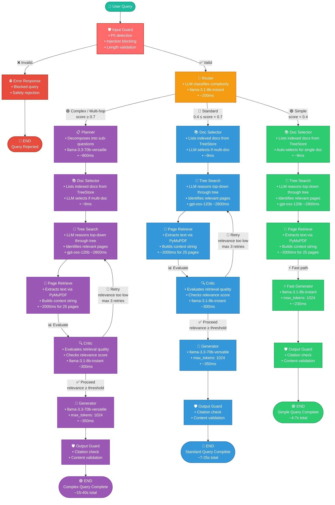

# PageIndex Query E2E Flow

The diagram below shows the exact LangGraph query pipeline with all 3 routing paths, conditional edges, and retry logic.

> [!NOTE]
> Color coding: 🟢 **Green** = Simple (fast path), 🔵 **Blue** = Standard path, 🟣 **Purple** = Complex path, 🔴 **Red** = Rejection, 🟡 **Yellow** = Shared nodes

## Path Summary

| Path | Nodes | Typical Latency | LLM Calls | Use Case |
|------|-------|-----------------|-----------|----------|
| 🟢 **Simple** | input_guard → router → doc_selector → tree_search → page_retrieve → **fast_generator** → output_guard | **4–7s** | 3 (router + tree_search×2 + fast_gen) | Single-fact queries, lookups |
| 🔵 **Standard** | input_guard → router → doc_selector → tree_search → page_retrieve → **critic** → generator → output_guard | **7–25s** | 5 (router + tree×2 + critic + gen) | Analysis, summaries, comparisons |
| 🟣 **Complex** | input_guard → router → **planner** → doc_selector → tree_search → page_retrieve → **critic** → generator → output_guard | **15–40s** | 6 (router + planner + tree×2 + critic + gen) | Multi-hop reasoning, cross-doc |

## Key Differences Between Paths

| Feature | 🟢 Simple | 🔵 Standard | 🟣 Complex |
|---------|-----------|-------------|-----------|
| Planner | ❌ | ❌ | ✅ Sub-question decomposition |
| Critic | ❌ | ✅ Evaluates relevance | ✅ Evaluates relevance |
| Retry Loop | ❌ | ✅ Up to 3 retries | ✅ Up to 3 retries |
| Generator Model | `8b-instant` (fast) | `70b-versatile` (full) | `70b-versatile` (full) |
| Context Window | 2000 chars | 8000 chars | 8000 chars |
